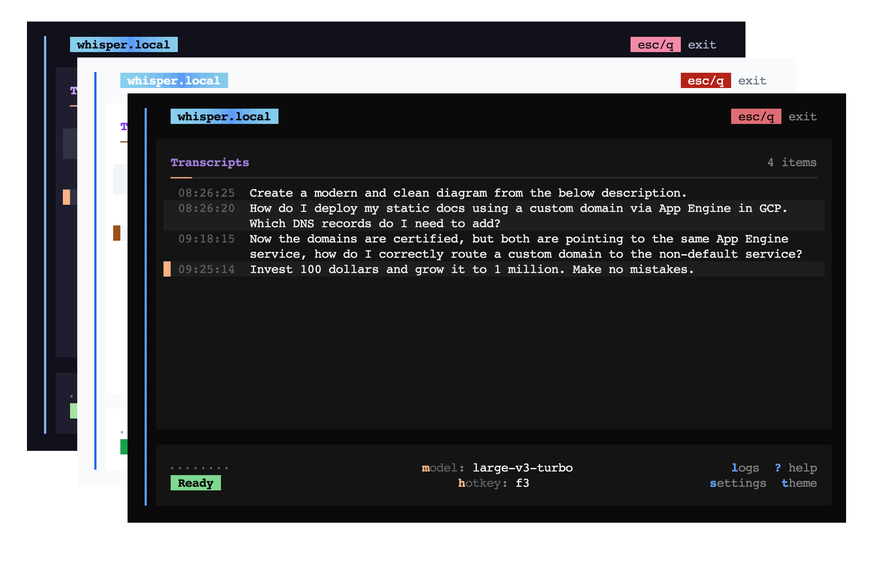

<div align="center">
  
  <h3>Press a key. Speak. Text appears.</h3>
  <p>Private by default. Fully local. Works anywhere you can type.</p>
</div>

<p align="center">
  <a href="https://github.com/mjmammoth/whisper.local/actions/workflows/ci.yml"></a>
  <a href="https://github.com/mjmammoth/whisper.local/releases/latest"></a>
  <a href="LICENSE"></a>
  <a href="https://coderabbit.ai/"></a>
</p>


<!-- tui-showcase:start -->

<!-- tui-showcase:end -->

---

### How it works

1. **Onboard in the TUI** — download a Whisper model, configure settings
2. **Hit the hotkey** (F3 by default) from any anywhere — system-wide, no focus switching
2. **Speak** — audio is captured, transcribed locally by Whisper
3. **Text appears** — transcription auto-pastes into your active app, or copies to clipboard

### Features

- **100% local & private** — no cloud, no telemetry, no network calls
- **Global hotkey** (push-to-talk or toggle) — works system-wide from any app
- **Auto-copy** — transcription goes straight to clipboard
- **Auto-paste** — transcribed text pastes directly into your active application
- **Auto-revert clipboard** — after auto-paste, previous clipboard content is restored by default
- **Terminal UI** built with OpenTUI + SolidJS — configure settings, transcript history
- **Pluggable runtimes** — faster-whisper (CPU/CUDA) or whisper.cpp (CPU/Metal GPU on macOS)
- **Model management** — download, remove, and select OpenAI Whisper models from tiny to large-v3-turbo
- **menu bar indicator** — status dot shows recording / transcribing / idle state
- Optional **Noise suppression** (RNNoise) and **voice activity detection** (VAD)
- **File transcription** — drag-and-drop or paste audio file paths

### Installation

#### macOS / Linux

```bash
curl -fsSL https://raw.githubusercontent.com/mjmammoth/whisper.local/main/install | bash
```

<details>
  <summary>Alternative Installation Methods</summary>

```bash
  # or
  brew install mjmammoth/tap/whisper.local
```
</details>

<details>
  <summary>Windows</summary>

  Download the latest `whisper-local-tui-windows-x64.tar.gz` from [Releases](https://github.com/mjmammoth/whisper.local/releases/latest), extract, and run.
</details>

### Quick Start

```bash
whisper.local tui     # guided onboarding, starts background service and opens terminal UI - useful for first-time configuration
whisper.local start   # start background service only
```

#### Upgrade

```bash
whisper.local upgrade # upgrade to latest version
```

### Troubleshooting

#### macOS permissions

Global hotkeys require **Input Monitoring** and auto-paste requires **Accessibility** permission for your terminal. Grant both in `System Settings` → `Privacy & Security`, then restart whisper.local.

#### Common issues

- **Hotkey does nothing** — grant Input Monitoring permission (see above)
- **Auto-paste fails** — grant Accessibility permission (see above)
- **No model selected** — run `whisper.local models pull small && whisper.local models select small`
- **PortAudio / input device errors** — check microphone selection and macOS microphone permissions
- **Wayland** — global key swallow isn't guaranteed; bind `whisper.local trigger toggle` to a desktop shortcut instead

> [!IMPORTANT]
> The code in this repo has mostly been created by AI-assisted workflows
